# COVID-19 Case-based Surveillance & Contact Tracing Tracker System Design v0.3.3 { #covid19-cs-design }

* Last updated 24/11/2021  
* Package version: 0.3.3
* DHIS2 Version compatibility 2.33.2  
* Demo: [https://demos.dhis2.org/covid-19](https://demos.dhis2.org/covid-19)

## Purpose

The COVID-19 Surveillance System Design document provides an overview of the conceptual design used to configure a COVID-19 digital data package in DHIS2. The COVID-19 package was developed in response to an expressed need from countries to rapidly adapt a solution for managing COVID-19 data. This document is intended for use by DHIS2 implementers at country and regional level to be able to support implementation and localisation of the package. The COVID-19 metadata package can be adapted to local needs and national guidelines. In particular, local work flows and national guidelines should be considered in the localization and adoption of the programs included in this package.

## Background

**This design has been updated to reflect new aggregate reporting requirements from the [WHO interim surveillance guidelines updated March 20, 2020][1]**. The COVID-19 digital data package was developed in response to an expressed need from countries to rapidly adapt a solution for managing COVID-19 data. UiO has developed COVID-19 surveillance packages for three types of data models (tracker, event-based aggregate) to enable countries to select the model that is most appropriate for their context given the burden of disease and available resources. These models and their relative benefits/limitations are summarized below:

| Type of Surveillance Package | Case-based Surveillance (Tracker) | Surveillance (Event) | Surveillance (Aggregate) |
|---|---|---|---|
| ***Description*** | Enrols a case and tracks over time through laboratory confirmation & case outcome | Captures critical case details in line-listing format | Enables daily or weekly reporting of key aggregate data points |
| ***Pros*** | Highly granular data and multiple time dimensions for analysis, can support decentralized workflow, all events linked to the case | More granular than aggregate and can capture key time dimensions (i.e. report date vs onset of symptoms); reduced burden of data entry compared to tracker and little complexity | Low complexity, easy to implement, most manageable when cases numbers are high |
| ***Cons*** | Burden of data entry may be overwhelming when number of cases reach threshold; complexity of implementation | Does not support case-follow up or other decentralized workflows | Less granularity for detailed analysis (i.e. analysis only based on case reporting date, limited disaggregation) |

**This document covers only the design of the surveillance tracker program package**; separate system design documents are available for DHIS2 event and aggregate packages.

WHO is “urging all countries to prepare for the potential arrival of COVID-19 by readying emergency response systems; increasing capacity to detect and care for patients; ensuring hospitals have the space, supplies and necessary personnel; and developing life-saving medical interventions.”

The objectives of COVID-19 surveillance are:

1. to monitor trends of the disease where human to human transmission occurs;
2. rapidly detect new cases in countries where the virus is not circulating;
3. provide epidemiological information to conduct risk assessments at the national, regional and global level; and
4. provide epidemiological information to guide preparedness and response measures.

The system design builds upon existing case-based disease surveillance principles and information system requirements that have been developed collaboratively between the WHO and UiO since 2017. The COVID-19 surveillance package was developed with the intent to align to [WHO technical guidance on nCoV-19 surveillance and case definitions][2], updated March 20, 2020. Note that this design may not necessarily reflect the latest available interim global guidance developed by WHO as updates may be released rapidly. National guidelines and policies may vary and it is recommended to adapt this package to local context.

## System Design Summary

The DHIS2 case-based surveillance tracker metadata was based on the **[WHO COVID-19 case reporting template][3]** and the mapping of data dictionaries can be accessed at: [DHIS2 CBS tracker metadata WHO line-list data dictionary][4].

In the development of this configuration package, an effort has been made to follow UiO’s [general design principles][5] and a common [naming convention][6].

The COVID-19 digital data package supports surveillance workflows and automated analysis for key components of routine and active surveillance. This package includes a Case Surveillance Tracker and Contact registration & follow-up tracker, which are installed together in the same metadata package. The tracker programs are optimized to be installed with other COVID-19 surveillance packages, including the Points of Entry Screening Tracker and aggregate daily surveillance dataset.

1. **[Use Case 1: COVID-19 Case-based surveillance tracker][7]**: enrols & tracks suspected cases; captures symptoms, demographics, risk factors & exposures; creates lab requests; links confirmed cases with contacts; and monitors patient outcomes. This package can be installed as a standalone COVID-19 package or can be integrated into a country’s existing integrated disease surveillance & response tracker. Metadata for the case-based surveillance tracker is aligned with the WHO [COVID-19 surveillance data dictionary][8]

    > n.b. The COVID-19 case-based tracker can be implemented either as a ‘standalone’ program for COVID-19 specific disease surveillance as described here; or, COVID-19 concepts can be integrated into an existing case-based surveillance tracker program if one already exists in-country. Please refer to installation and implementation guidance for more details.

1. **[Use Case 2: Contact registration & follow-up][9]**: strengthens active case detection through contact tracing activities, such as identification and follow-up of contacts of a suspected or confirmed COVID-19 case.

Digital data packages are optimized for Android data collection with the DHIS2 Capture App, free to download on the [Google Play store][10].

## Use Case 1: COVID-19 Case-based surveillance tracker

The COVID-19 case-based surveillance tracker can be adapted and used by countries to supplement existing national disease surveillance programs. The basic case surveillance program is designed to:

1. Enroll suspected\* COVID-19 cases (*generally appearing at a health facility, but may be enrolled at other places*)
2. Capture key information about the suspected case including demographics and exposures, such as symptoms, contact with a previously confirmed case & travel history
3. Generate lab requests
4. Record laboratory diagnosis
5. Record contacts of a confirmed\*\* or probable\*\*\* case for follow-up
6. Record case outcome
7. Facilitate case notification and national/regional/global case reporting
8. Generate dashboards and analytics tools for monitoring disease trends and planning response efforts

The design of the case-based tracker program assumes that [WHO case definitions][1] are followed in the use case; its use can be adapted to local case definitions as needed. The WHO case definitions were updated on March 20, 2020 and noted below.

> \* Suspected case: A) a patient with acute respiratory illness (fever and at least one sign/symptom of respiratory disease (e.g., cough, shortness of breath), AND with no other aetiology that fully explains the clinical presentation AND a history of travel to or residence in a country/area or territory reporting local transmission of COVID-19 disease during the 14 days prior to symptom onset; **OR**, B) A patient with any acute respiratory illness AND having been in contact with a confirmed or probable COVID-19 case (see definition of contact) in the last 14 days prior to onset of symptoms; **OR,** C) A patient with severe acute respiratory infection (fever and at least one sign/symptom of respiratory disease (e.g., cough, shortness breath) AND requiring hospitalization AND with no other aetiology that fully explains the clinical presentation.
>
>\*\* Probable case: A) a suspect case for whom testing for COVID-19 is inconclusive (inconclusive being the result of the test reported by the laboratory) **OR,** B) a suspect case for whom testing could not be performed for any reason.
>
>\*\*\* Confirmed case: A person with laboratory confirmation of COVID-19 infection, irrespective of clinical signs and symptoms.

### Intended users

* Health facility users: capture and record details about a suspected case, including clinical symptoms & exposures; track lab results; record case outcome
* Laboratory users: receive lab requests and record laboratory results for a particular suspected case
* National and local health authorities: monitor and analyse disease surveillance data through dashboards and analytics tools to conduct risk assessments and plan response measures; generate reports for regional and global reporting

### Workflow: COVID-19 Case-based Surveillance Tracker

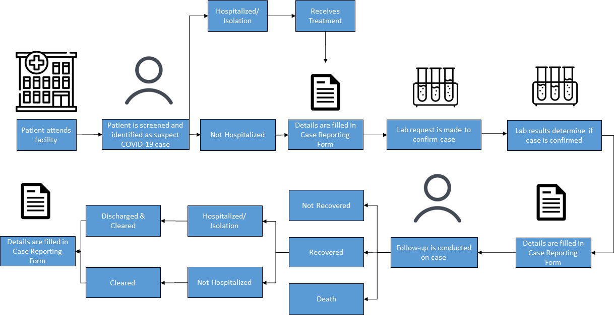

### Structure: COVID-19 Case Surveillance Tracker Program

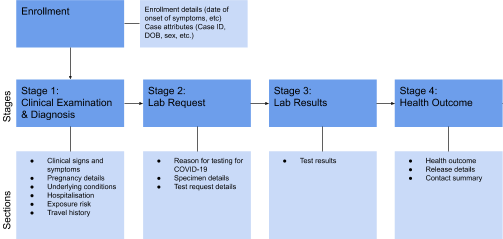

#### Program Description: COVID-19 Case Testing, Diagnosis & Outcome

| Stage | Description |
|---|---|
| **Enrollment details &amp; Attributes** | The Tracked Entity is the case, which is represented by a Tracked Entity Type of ‘person.’ The *Enrollment date* is the date of registration of the case. The Related programs is *COVID-19 Contact registration &amp; follow-up*. The attributes include the following basic personal information and unique case identifiers: *System Generated Case ID*, *Local Case ID*, *Age*, *First Name*, *Surname*, *Sex*, *Case phone number*, *First Name (parent or care)*, *Surname (parent or carer)*, *Home Address*, *Workplace/school physical address*, *Country of Residence*, *Facility contact number*|
| **Stage 1: Clinical Examination and Exposures** | This stage records a suspected case’s clinical symptoms and exposures including: *Symptoms*, *Pregnancy and underlying conditions*, *Hospitalisation and Isolation*, *Exposures in 14 days prior to symptoms*, *Travel history*, *Contact with confirmed case*. After examination, you can record if the case has been hospitalised or isolated, and information surrounding this. |
| **Stage 2: Lab Request [repeatable]** | The lab request records the reason for testing and other information that a lab needs to process a sample and test it for COVID19. The information provided here can help lab personnel prioritize lab tests when resources are limited. The person entering this data could be the same person who registered the suspected case and recorded the patient’s clinical exam and exposures; or may be other personnel charged with making lab requests. |
| **Stage 3: Lab Results [repeatable]** | The Lab Results stage records the type and results from laboratory testing. It can be done directly at the lab or as secondary data entry. This stage is repeatable as samples for a given case may be tested multiple times (i.e. in the case of an inconclusive laboratory results, a new lab test can be conducted and results recorded). |
| **Stage 4: Health Outcome** | The health outcome records the final outcome of the case: (recovered, not recovered, dead or unknown) including date of discharge or death as applicable. |

#### Enrollment

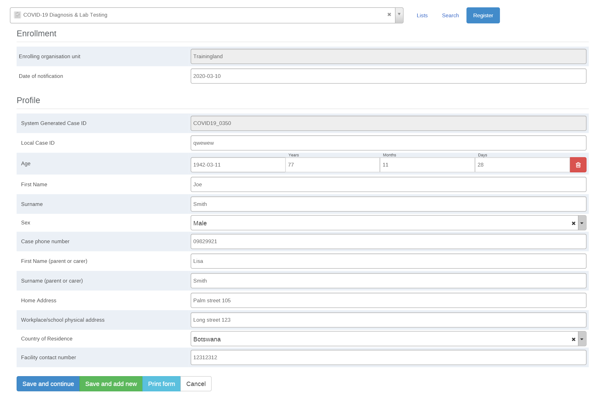

#### Program Stage 1 - Clinical Examination & Diagnosis

##### Section 1 - Clinical Signs and symptoms

Selecting “yes” to the Data Element ‘Any signs or symptoms?’ reveals the rest of the options.

##### Section 2 - Pregnancy Details

This section is hidden unless gender is selected as ‘Female.’

##### Section 3 - Underlying Conditions/Comorbidity

The details of this section are hidden unless “Any underlying conditions” is marked as “Yes”.  

##### Section 4 - Hospitalisation

The details of this section is hidden unless “Hospitalised” is marked as “Yes”.

##### Section 5 - Exposure Risk

This section is used to record exposures 
1. The fields ***country, city and facility*** are hidden by program rules if the case is not a health care worker; 
2. The fields for contact IDs are hidden by program rules if the case has not had contact with a confirmed case in 14 days.

A suspected case’s exposure to a *previously confirmed* case is distinct from prospective contact tracing in Program Stage 5.

##### Section 6 - Travel History

#### Program Stage 2: Lab Request

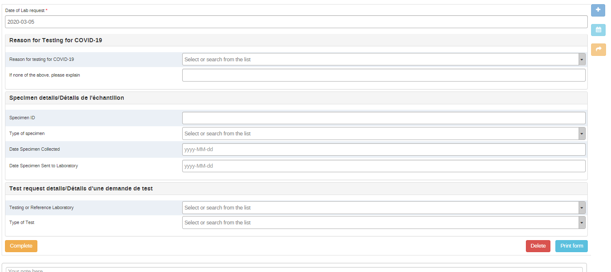

#### Stage 3: Lab Results

#### Stage 4: Health Outcomes

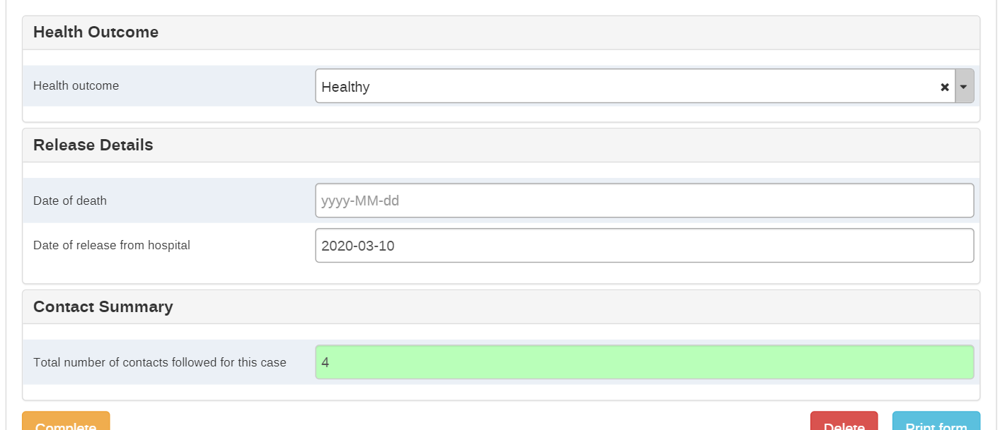

### Program Rules: COVID19 Case Surveillance Tracker

The following program rules have been configured. If a country has an existing case-based surveillance program and wishes to incorporate elements of the COVID-19 case-based tracker into their existing program, special attention must be paid to the configuration of program rules.

| Program Rule Name | Program Rule Description |
|---|---|
| Assign Enrollment Date | This assigns the enrollment date if there is no onset date available to the variable calculated onset date (for indicators). This variable is used as a custom parameter in some of the program indicators. |
| Assign Onset Date| This assigns the onset date to the variable calculated onset date (for indicators). This variable is used as a custom parameter in some of the program indicators.|
| Calculate and assign patient age in years | Calculate and assign patient age in years based on DOB |
| Display patient age in years + days | Display patient age in years + days |
| Hide Date of Death | Hide 'Date of Death' unless Death is the health outcome |
| Hide Date of Discharge | Hide Date of Discharge if no outcome or if the outcome is death |
| Hide Measured Temperature field | Hide Measured Temperature field until Fever is selected |
| Hide confirmed case ID's if no contact with other confirmed cases| Hides any contact ID's if the case has not been in any contact with other confirmed cases |
| Hide health care worker details if not a health worker | Hide health care worker details if not a health worker |
| Hide health outcome explanation if health outcome is not other | Hide health outcome explanation if health outcome is not other |
| Hide hospitalisation details if hospitalisation is no or unknown | Hide hospitalisation details if hospitalisation is no or unknown |
| Hide isolation date if case is not in isolation | Hide isolation date if case is not in isolation |
| Hide pregnancy details for a female if not pregnant | Hide pregnancy details for a female if not pregnant |
| Hide pregnancy details section if sex is male | Hide pregnancy details section if sex is male |
| Hide reason for testing explanation if an option is selected | Hide reason for testing explanation if an option is selected |
| Hide travel history details if no travel 14 days prior to symptom onset | Hide travel history details if no travel 14 days prior to symptom onset |
| Hide underlying conditions if case does not have any | Hide underlying conditions if case does not have any |
| Show warning if the event date is after the enrollment date | Show warning on completion of an event if the event date is before the enrollment date |

You can read more about program rules here: [https://docs.dhis2.org/master/en/user/html/configure\_program\_rule.html][11]

### Program Indicators

From the data captured in the COVID-19 case surveillance program, we can calculate at least the following indicators including those recommended by the WHO for daily and weekly aggregate reporting and present them in a dashboard:

| Indicator name | Description |
|---|---|
| COVID-19 - Cases treated with mechanical ventilation or ECMO or admitted in intensive care unit (ICU) | *Cases treated with mechanical ventilation or ECMO or admitted in intensive care unit (ICU)* |
| COVID-19 Contacts | *Counts the number of relationships (‘has been in contact with’) created that are linked to the case TEI* |
| COVID-19 - Deaths (all suspected cases) | *COVID-19 related deaths (deaths recorded among all suspected cases)* |
| COVID-19 - Deaths (confirmed cases) | *COVID-19 related deaths (deaths recorded among confirmed cases)* |
| COVID-19 - Deaths (probable cases) | *COVID-19 related deaths (deaths recorded among all probable cases)* |
| COVID-19 - Confirmed Hospitalised Cases | *Number of confirmed cases that were admitted into hospital* |
| COVID-19 - Imported Cases | *Cases where likely source of infection is recorded as another country or imported from another country.* |
| COVID-19 - Laboratory confirmed cases | *Suspected cases that were confirmed through laboratory testing (multiple lab tests may be conducted; this indicator assumes that the last test result is* "Positive"*); displayed by report date* |
| COVID-19 - Laboratory confirmed cases - by onset of symptoms | *Suspected cases that were confirmed through laboratory testing (multiple lab tests may be conducted; this indicator assumes that the last test result is* "Positive"*); displayed by date of onset of symptoms* |
| COVID-19 - Laboratory tested cases | *Number of suspected cases that received a laboratory test (includes inconclusive lab testing results)* |
| COVID-19 - Local transmission cases | *Number of suspected cases where transmission is local (no travel in last 14 days* |
| COVID-19 - Probable cases | *Suspected cases with inconclusive laboratory results or not tested for any reason, by reported date* |
| COVID-19 - Probable cases - by onset of symptoms | *Suspected cases with inconclusive laboratory results or not tested for any reason, by date of onset of symptoms* |
| COVID-19 - Recovered confirmed cases | *Number of laboratory confirmed cases with outcome recovered*|
| COVID-19 - Suspected cases | *Total number of cases suspected with COVID-19, by report date* |
| COVID-19 - Suspected cases - by onset of symptoms | *Total number of cases suspected with COVID-19, by date of onset of symptoms* |
| COVID-19 - Suspected cases without a positive test result | *Total number of suspected cases without a positive lab result* |
| COVID-19 Total number of laboratory tests conducted | *Total number of lab tests conducted (count of tests, not cases)* |
| COVID-19 Total number of positive tests | *Total number of lab tests returned with positive results (count of tests, not cases* |
| COVID-19 Deaths by sex and age group | ***Male**: 0-4, 5-14, 15-24, 25-34, 35-44, 45-54, 55-64, 65-74, 75-84, 85+ &#124; **Female**: 0-4, 5-14, 15-24, 25-34, 35-44, 45-54, 55-64, 65-74, 75-84, 85+* |
| COVID-19 Confirmed cases by sex and age group | ***Male**: 0-4, 5-14, 15-24, 25-34, 35-44, 45-54, 55-64, 65-74, 75-84, 85+ &#124; **Female**: 0-4, 5-14, 15-24, 25-34, 35-44, 45-54, 55-64, 65-74, 75-84, 85+* |
| COVID-19 Suspected cases by sex and age group | ***Male**: 0-4, 5-14, 15-24, 25-34, 35-44, 45-54, 55-64, 65-74, 75-84, 85+ &#124; **Female**: 0-4, 5-14, 15-24, 25-34, 35-44, 45-54, 55-64, 65-74, 75-84, 85+* |

## Use Case 2: COVID-19 Contact registration & follow-up

This program can be used in addition to the case-based surveillance tracker to facilitate the registration and follow-up of contacts of a confirmed case. In this scenario, it is assumed that if any contacts of a confirmed case meet criteria for suspected case and are referred for testing, the case will be enrolled into the COVID-19 Case Surveillance tracker program.

The Contact registration & follow-up program registers each contact of a case (as described in COVID-19 Case Surveillance Use Case) as a new Tracked Entity Instance (person) and links them to the case in the COVID-19 Case Surveillance Program via a ‘relationship.’ It has a simple repeatable follow-up stage where symptoms and any follow-up undertaken can be registered.

### Workflow: Contact registration & follow-up

### Program Description: Contact registration & follow-up

| Stage | Description |
|---|---|
| **Enrollment details &amp; Attributes** | The Tracked Entity is represented by a Tracked Entity Type of ‘person.’ The Related program is *COVID-19 Case based surveillance*. The attributes include the following basic personal information and unique case identifiers: *System Generated Case ID*, *Local Case ID*, *First Name*, *Surname*, *Date of birth*, *Age*, *Sex*, *Phone number (local)*, *Home Address*, *Country of Residence* |
| **Stage 1: Follow-Up [non-repeatable]** | This stage is meant to record information related to contact tracing follow up, given that a contact has already been identified. It is divided into two sections: *1. Relation with case*, *2. Exposure Assessment* |
| **Stage 2: Symptoms[repeatable]** | This stage is intended to record symptoms of the case. Follow-up to check on the symptoms of a contact can be repeated until the follow-up period is complete (for example, after 14 days or according to national guidelines). When follow-up period is complete, the enrollment can be ‘completed.’ *1. Symptoms*|

Contacts are added to the index case using the relationships menu in the case surveillance program:

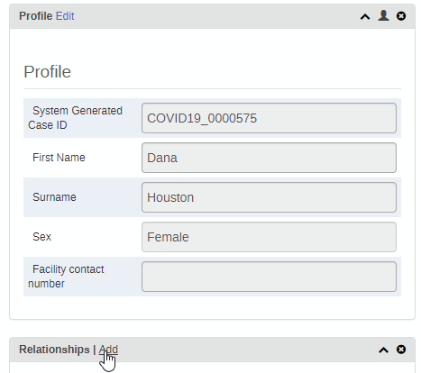

Once you select “Add” from the relationships box, you are able to select the relationship and program and either select an existing person or enroll a new contact using the enrollment stage that appears. This will enroll the contact into the contact registration and follow-up
program.

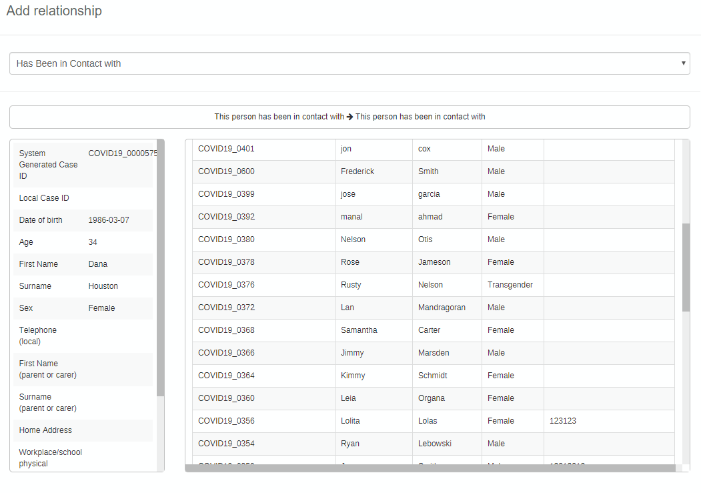

Contacts that are added will then be listed on the case’s tracker dashboard in the relationship
widget

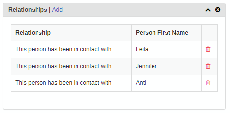

You may also enroll them separately into the program. Once enrolled, you will be able to find them for the follow-up as required.

#### Enrollment

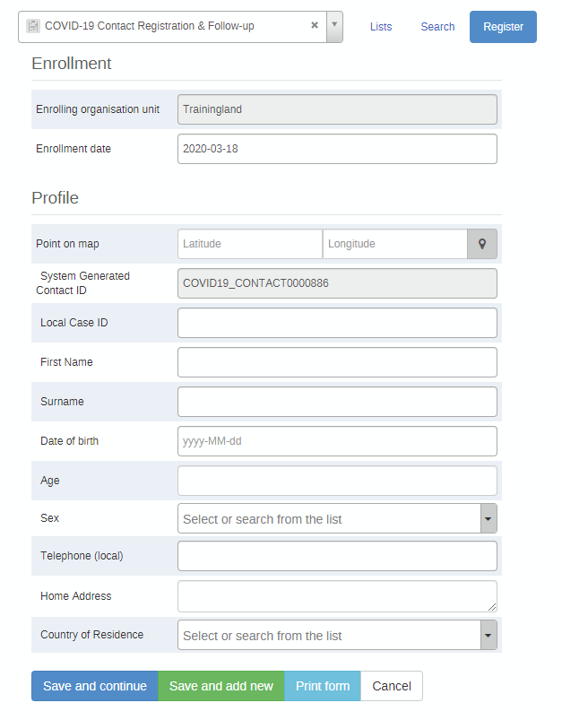

#### Program Stage 1 : Follow - Up

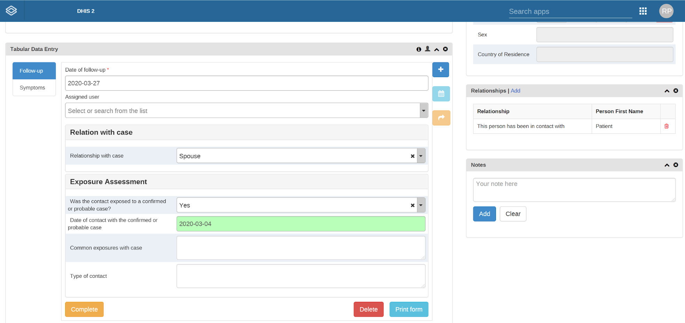

#### Program Stage 2 : Symptoms

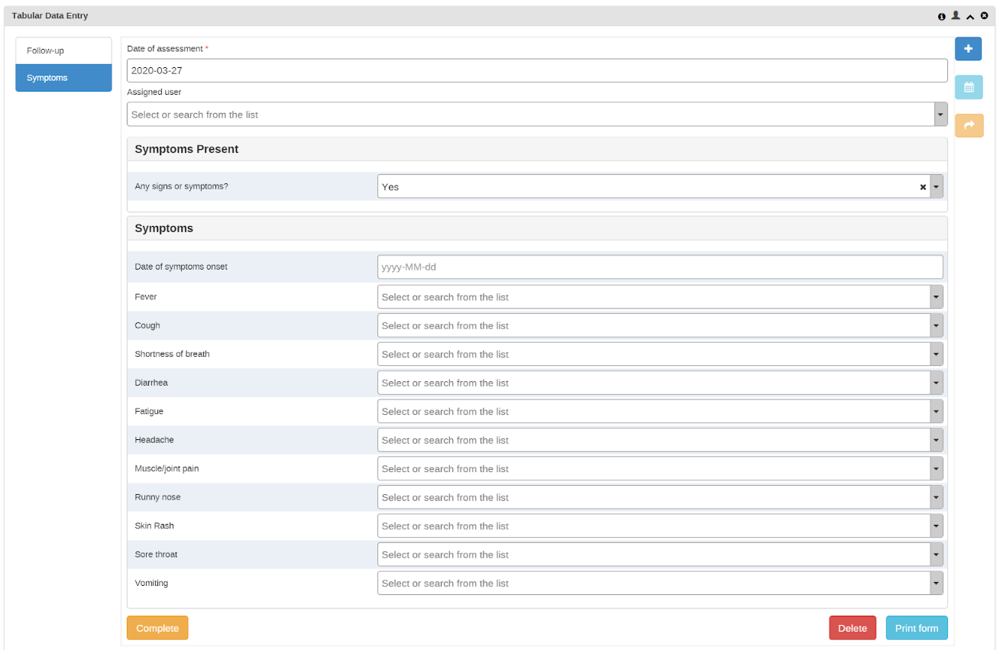

### Program Indicators: Contact Registration

| Program Indicator Name | Description |
|---|---|
| COVID-19 travelers screened | Total number of travelers screened and enrolled in screening program from POE |
| COVID-19 travelers cleared at POE | Number of travelers cleared after POE screening (no follow-up required) |
| COVID-19 travelers with symptoms at POE | Number of travelers presenting with symptoms during POE screening |
| COVID-19 travelers cleared after 14 days monitoring | Number of travelers that are cleared after 14 day follow up (no onset of symptoms during 14 day period) |
| COVID-19 travelers referred to health facility | Number of travelers that were referred to a health facility at any time during 14 day followup |
| COVID-19 travelers enrolled for 14 day follow-up | Number of travelers that did not present with symptoms at POE screening and were not cleared at POE screening |
| COVID-19 currently under follow-up | Number of travelers that have not been cleared or referred to a health facility |
| COVID-19 travelers developed symptoms during follow-up | Number of travelers that developed symptoms during follow-up (exclude travelers presenting with symptoms during POE screening) |

## References

* WHO Technical guidance on COVID-19 surveillance and case definitions (last updated 20 March 2020) [https://www.who.int/emergencies/diseases/novel-coronavirus-2019/technical-guidance/surveillance-and-case-definitions](https://www.who.int/emergencies/diseases/novel-coronavirus-2019/technical-guidance/surveillance-and-case-definitions)
* WHO Data Dictionary for COVID-19 Case Reporting Form [https://www.who.int/docs/default-source/coronaviruse/2020-02-27-data-dictionary-en.xlsx](https://www.who.int/docs/default-source/coronaviruse/2020-02-27-data-dictionary-en.xlsx)
* WHO Laboratory testing for 2019 novel coronavirus (2019-nCoV) in suspected human cases (last updated 2 March 2020) [https://www.who.int/publications-detail/laboratory-testing-for-2019-novel-coronavirus-in-suspected-human-cases-20200117](https://www.who.int/publications-detail/laboratory-testing-for-2019-novel-coronavirus-in-suspected-human-cases-20200117)
* WHO Considerations in the investigation of cases and clusters of COVID-19 (last updated 13 March 2020) [https://www.who.int/internal-publications-detail/considerations-in-the-investigation-of-cases-and-clusters-of-covid-19](https://www.who.int/internal-publications-detail/considerations-in-the-investigation-of-cases-and-clusters-of-covid-19)
* WHO Coronavirus situation reports [https://www.who.int/emergencies/diseases/novel-coronavirus-2019/situation-reports](https://www.who.int/emergencies/diseases/novel-coronavirus-2019/situation-reports)

[1]: https://apps.who.int/iris/bitstream/handle/10665/331506/WHO-2019-nCoV-SurveillanceGuidance-2020.6-eng.pdf
[2]: https://www.who.int/emergencies/diseases/novel-coronavirus-2019/technical-guidance/surveillance-and-case-definitions
[3]: https://www.who.int/docs/default-source/coronaviruse/2020-02-27-data-dictionary-en.xlsx
[4]: https://drive.google.com/open?id=1vigXHkP7L2hJ2lrZpdf9u4csQtppMH16
[5]: https://docs.dhis2.org/en/topics/metadata/dhis2-who-digital-health-data-toolkit/general-design-principles-for-who-metadata-packages.html
[6]: https://docs.dhis2.org/en/topics/metadata/dhis2-who-digital-health-data-toolkit/naming-conventions.html
[7]: #use-case-1-covid-19-case-based-surveillance-tracker
[8]: https://www.who.int/docs/default-source/coronaviruse/data-dictionary-covid-crf-v6.xlsx?sfvrsn=a7d4ef98_2
[9]: #use-case-2-covid-19-Contact-registration-follow-up
[10]: https://play.google.com/store/apps/details?id=com.dhis2&hl=en
[11]: https://docs.dhis2.org/en/use/user-guides/dhis-core-version-master/configuring-the-system/programs.html#configure_program_rule
